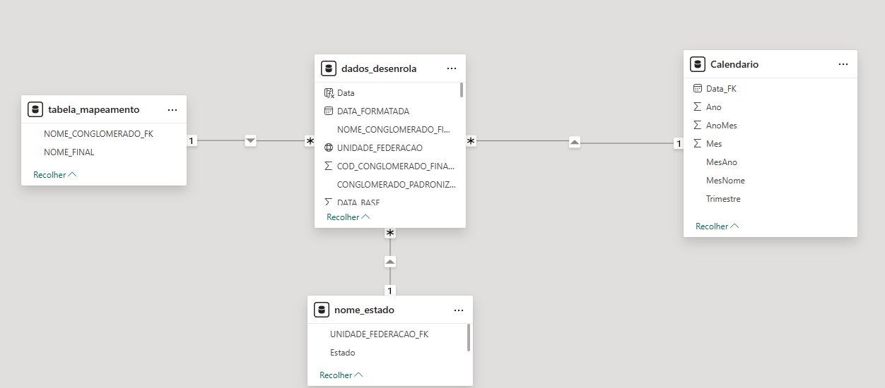
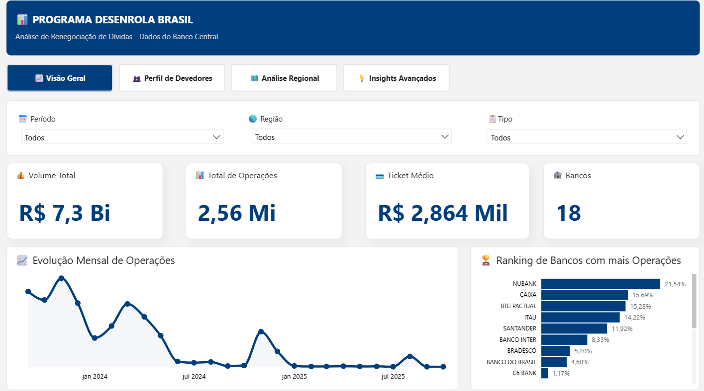
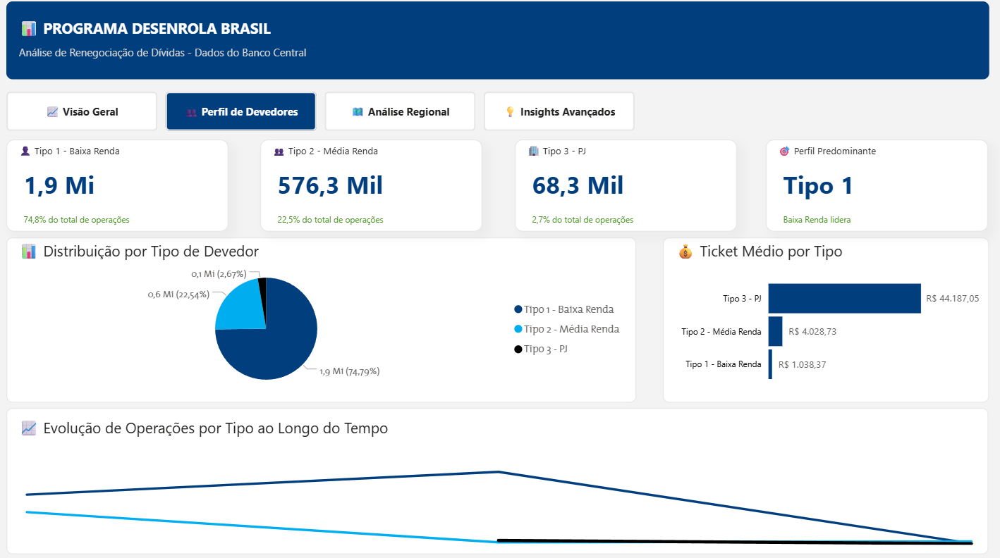
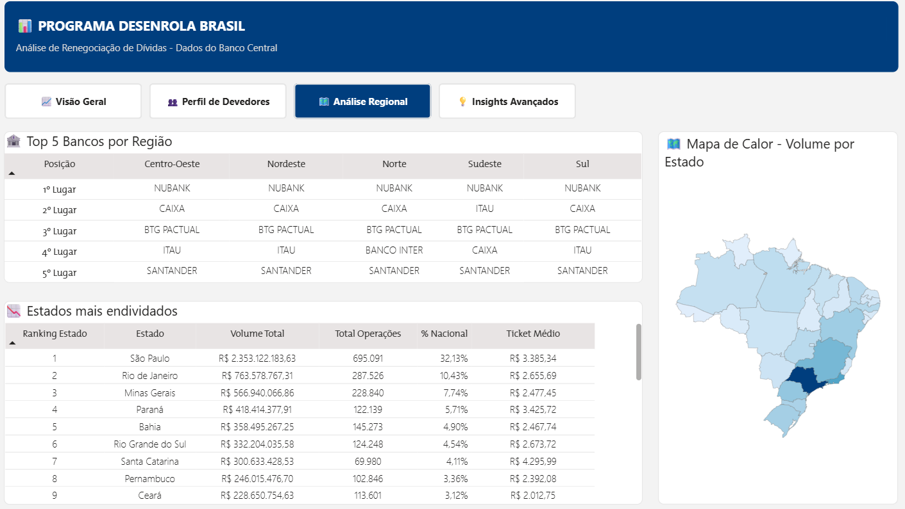
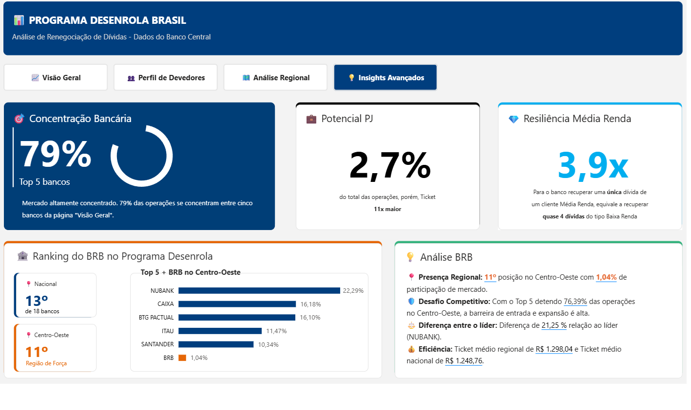

# Análise dos Dados do Programa Desenrola Brasil

Este projeto foi o diferencial técnico que me fez ser aprovado em 1º lugar no processo seletivo de estágio no **BRB (Banco de Brasília)** no **NUPEC (Núcleo de Planejamento e Controle)**. Trata-se de uma análise profunda dos [dados abertos do Banco Central](https://dadosabertos.bcb.gov.br/dataset/desenrola-brasil) sobre a renegociação de dívidas (Lei nº 14.690/2023), transformando bases brutas em insights estratégicos para o setor bancário.

---

## 🎯 Objetivo do Projeto
Analisar o panorama nacional do Programa Desenrola Brasil, identificando perfis de devedores, concentração bancária e o posicionamento competitivo do BRB.

## 🛠️ Stack Tecnológica
* **Business Intelligence:** Power BI.
* **ETL & Tratamento:** Power Query (Linguagem M).
* **Cálculos Avançados:** Medidas DAX.
* **Design e UI/UX:** De acordo com o [Manual de Identidade Visual do BRB](https://novo.brb.com.br/wp-content/uploads/2021/09/Manual-de-Identidade-2021.pdf) (Cores e Fonte The Mix).

## ⚙️ Engenharia e Transformação de Dados
Para garantir a precisão da análise, superei desafios técnicos críticos na base bruta:

* **Conversão de Datas:** Utilizei Linguagem M para converter o formato `AAAA/MM` em `DATA_FORMATADA`, permitindo a análise correta de cronogramas e evolução mensal.
* **Padronização de Conglomerados:** Implementei uma `tabela_mapeamento.xlsx` para unificar instituições com nomes variantes, como "BCO BRASIL" e "BB", gerando uma coluna padronizada.
* **Ajuste de Geolocalização:** Criei uma estrutura para corrigir conflitos de siglas onde o Power BI confundia estados brasileiros com americanos (ex: AL = Alabama corrigido para Alagoas).

## 💡 Insights e Inteligência Analítica

### 1. Perfil dos Devedores
* **Dominância do Tipo 1:** Pessoas com renda de até 2 salários-mínimos detêm a vasta maioria das operações (74,8% do total).
* **Ticket Médio PJ:** Embora represente apenas 2,7% das operações, o ticket médio do setor PJ é **11x maior** que o de Pessoas Físicas.

### 2. Posicionamento do BRB
* **Market Share:** O banco ocupa a **13ª posição nacional** entre as 18 instituições participantes e a **11ª posição na região Centro-Oeste**.
* **Métrica de Resiliência:** O cálculo comprovou que recuperar uma única dívida de um cliente **Média Renda (Tipo 2)** equivale financeiramente a recuperar **3,9x** (quase 4 dívidas) do público Baixa Renda.

---

## 🏗️ Modelagem de Dados (Star Schema)
A eficiência do dashboard é garantida por uma modelagem em **Star Schema**, separando claramente as dimensões da tabela fato. Isso permite uma performance otimizada e cálculos DAX mais robustos.

  

### Componentes do Modelo:
* **Tabela Fato (`dados_desenrola`):** Contém os registros brutos de operações e métricas de volume.
* **Dimensão Calendário:** Criada para suportar análises de inteligência de tempo (Time Intelligence).
* **Tabela de Mapeamento:** Utilizada para o saneamento e padronização dos nomes dos conglomerados financeiros.
* **Dimensão Estados (`nome_estado`):** Criada especificamente para tratar nomes de estados com acentuação e siglas, corrigindo erros de geolocalização nativos do Power BI.

---

## 🖼️ Interface do Dashboard

Aqui estão as quatro visões principais desenvolvidas para o banco:

### Visão Geral e Perfil

  
  

### Análise Regional e Insights Avançados

  
  

---

[⬅️ Voltar para o Início](../index.md)