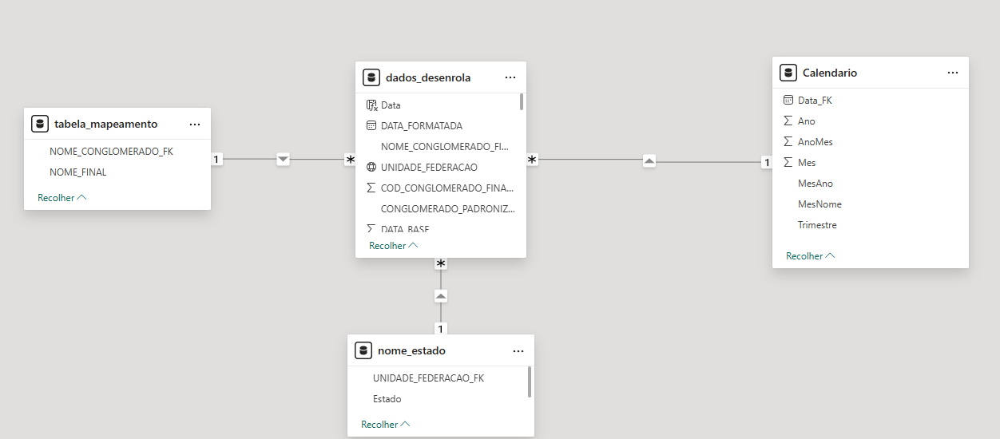
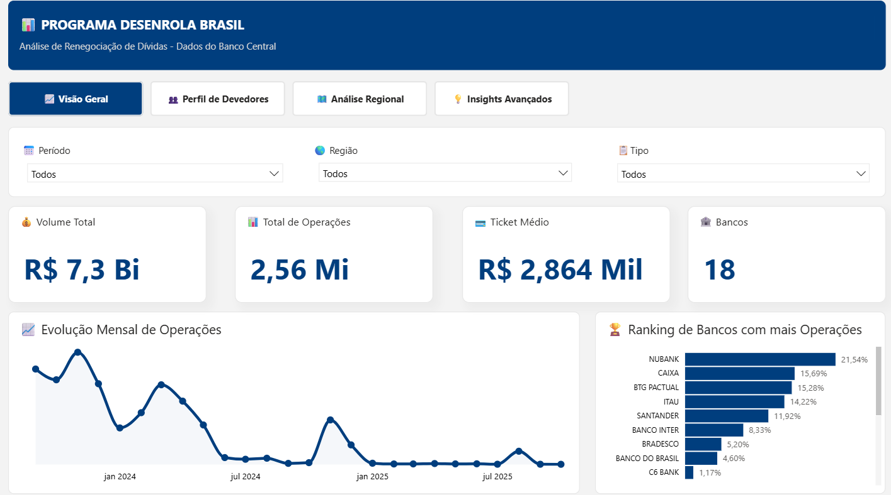
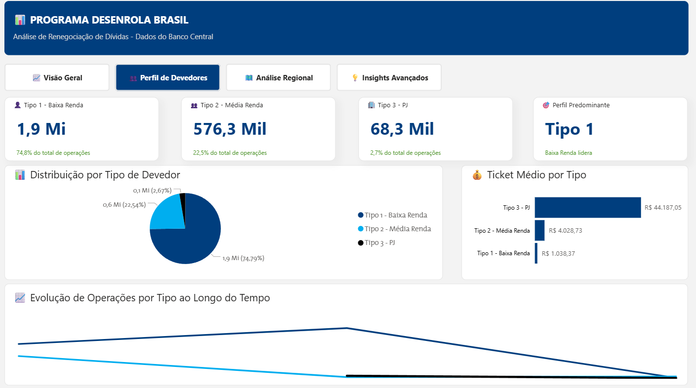
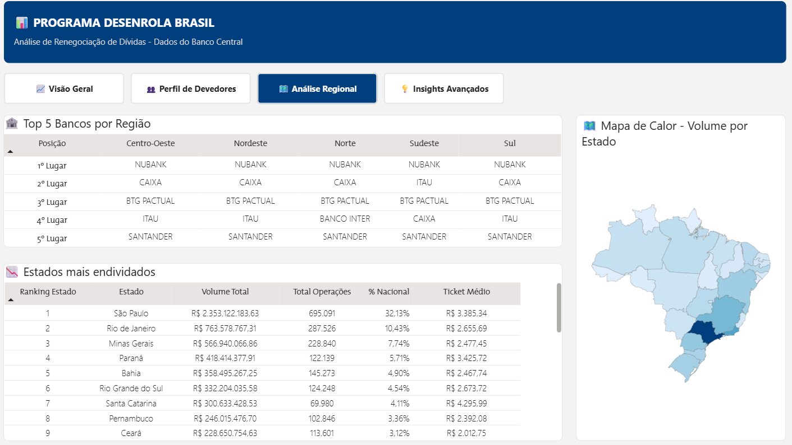
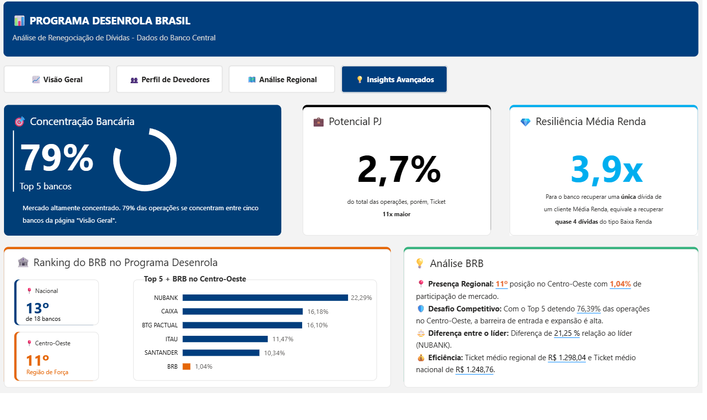

# Análise de Dados do Programa Desenrola Brasil

  Banco de Brasília (BRB)
  Business Intelligence
  Power BI
  DAX
  Star Schema

  

Projeto analítico desenvolvido com base nos [dados abertos do Banco Central](https://dadosabertos.bcb.gov.br/dataset/desenrola-brasil) sobre a renegociação de dívidas do Programa Desenrola Brasil (Lei nº 14.690/2023). O trabalho serviu como estudo técnico avaliado em processo seletivo do **Banco de Brasília (BRB)** para o Núcleo de Planejamento e Controle (NUPEC).

O objetivo principal foi transformar microdados públicos em indicadores de inteligência de mercado, mapeando o perfil dos devedores, a concentração bancária por instituição e a participação competitiva do BRB no cenário nacional e regional.

---

## Objetivo

Mapear a distribuição das dívidas renegociadas no Brasil, identificar o perfil socioeconômico dos devedores, analisar a concentração por instituição financeira e mensurar a representatividade da carteira do BRB no Centro-Oeste e no país.

---

## Stack Tecnológica

* **Business Intelligence:** Power BI (painéis analíticos e visões executivas).
* **ETL & Tratamento:** Power Query e Linguagem M (limpeza, tipagem e modelagem).
* **Cálculos e Métricas:** Medidas avançadas em DAX (Time Intelligence, médias ponderadas e proporções).
* **Diretrizes Visuais:** Alinhamento ao Manual de Identidade Visual do BRB (paleta institucional e fontes padronizadas).

---

## Engenharia e Tratamento de Dados

A base disponibilizada pelo Banco Central exigiu etapas rigorosas de saneamento para viabilizar cálculos dimensionais confiáveis:

* **Normalização temporal:** Conversão de strings de formato `AAAA/MM` em datas contínuas (`DATA_FORMATADA`) via Linguagem M para habilitar funções de inteligência de tempo.
* **Padronização de conglomerados:** Criação de tabela de mapeamento auxiliar para unificar variações nominais de instituições financeiras (ex: divergências de grafia entre "BCO BRASIL", "BB" e conglomerados afins).
* **Geolocalização:** Tratamento dos códigos de Unidade Federativa (UF) para evitar conflitos nativos de georreferenciamento do Power BI (como a interpretação de "AL" como estado norte-americano).

---

## Modelagem Dimensional (Star Schema)

A arquitetura dos dados foi estruturada no modelo **Star Schema**, garantindo performance nas consultas DAX e simplicidade na manutenção:

  

Arquitetura dimensional: separação entre tabela fato transacional e dimensões analíticas.

* **Fato (`dados_desenrola`):** Volumes financeiros, quantidade de operações e descontos concedidos.
* **Dimensão Calendário (`dCalendario`):** Base temporal para filtros de ano, trimestre e mês.
* **Dimensão Conglomerados:** Normalização dos bancos participantes.
* **Dimensão Estados (`dEstados`):** Regiões, nomes por extenso e siglas sanitizadas.

---

## Principais Métricas e Insights

### Perfil dos Devedores
* **Concentração no Tipo 1:** Pessoas físicas com renda de até 2 salários-mínimos concentraram a grande maioria das operações registradas (74,8% do volume total).
* **Ticket Médio Pessoa Jurídica:** Embora representasse apenas 2,7% das operações, o ticket médio do segmento PJ foi aproximadamente **11 vezes superior** ao de pessoas físicas.

### Posicionamento Competitivo
* **Market Share:** O BRB registrou a **13ª posição nacional** entre as instituições habilitadas e a **11ª posição na Região Centro-Oeste**.
* **Equivalência Financeira:** O cálculo de impacto mostrou que recuperar o valor médio de uma única dívida de cliente de Média Renda (Tipo 2) equivale financeiramente a **3,9 renegociações** do público de Baixa Renda.

---

## Visões do Dashboard

  
  

    
    
Visão Geral — Volume total renegociado, ticket médio e distribuição temporal

  

  

    
    
Perfil dos Devedores — Segmentação por faixa de renda e natureza jurídica

  

  

    
    
Análise Regional — Concentração geográfica e representatividade por UF

  

  

    
    
Insights Avançados — Benchmark competitivo e posicionamento do BRB

  

---

<a href="../../" class="back-link">&larr; Voltar para o Início</a>