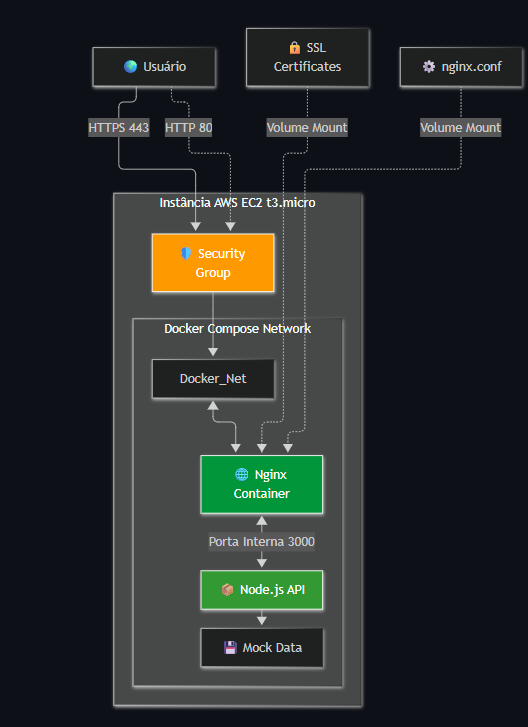
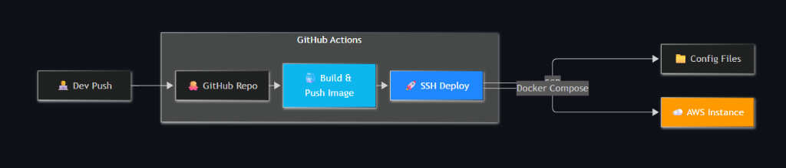

# Infraestrutura Cloud & CI/CD — AWS DevOps Deploy

<div class="hero-badges" style="margin-bottom: 20px;">
  <span class="tech-tag">Projeto Pessoal</span>
  <span class="tech-tag">DevOps & Cloud</span>
  <span class="tech-tag">AWS EC2</span>
  <span class="tech-tag">Docker Compose</span>
  <span class="tech-tag">CI/CD</span>
</div>

Implementação de uma infraestrutura em nuvem na **Amazon Web Services (AWS)** para publicação resiliente e escalável de uma API em **Node.js/Express**, orquestrada com **Docker Compose**, protegida por **Nginx** como Proxy Reverso com suporte a **SSL/TLS**, e automatizada por uma esteira completa de **CI/CD no GitHub Actions** com paridade de ambientes e estratégia de **rollback instantâneo e imutável**.

<div align="center" style="margin: 18px 0 24px 0;">
  <a href="https://github.com/marceloverass/devops-deploy" target="_blank" rel="noopener" class="report-btn report-btn--primary" style="display: inline-flex; width: auto; padding: 8px 22px;">
    Acessar Repositório no GitHub &nearr;
  </a>
</div>

> **Nota sobre Ambientes de Nuvem:** A infraestrutura foi provisionada e validada em instâncias AWS EC2 (*t3.micro*) com ambientes segregados de Staging e Produção. Após os testes de validação da esteira e conformidade, os servidores foram desativados para otimização de custos com nuvem, permanecendo todos os manifestos (`docker-compose.yml`, `nginx.conf`, Dockerfile e GitHub Actions) documentados e prontos para provisionamento.

---

## Contexto e Desafios

O projeto foi concebido para estruturar uma esteira de entrega contínua moderna e segura para serviços web, abordando desafios comuns de arquitetura e infraestrutura:

* **Exposição indevida da aplicação:** Evitar que a API Node.js seja acessível diretamente pela internet em portas públicas, isolando-a em uma rede virtual interna atrás de um Proxy Reverso com terminação TLS/SSL.
* **Eliminação de tarefas manuais de deploy:** Automatizar a verificação estática de código (ESLint) e testes unitários (Jest) a cada push, prevenindo falhas em produção decorrentes de erros humanos.
* **Paridade entre ambientes:** Garantir que o ambiente de homologação (*Staging*) replique fielmente o ambiente produtivo (*Produção*), minimizando discrepâncias comportamentais entre fases.
* **Rollback rápido e determinístico:** Eliminar o risco de dependência da tag `:latest` do Docker, implementando versionamento imutável baseado no SHA do commit do Git para reversão em segundos em cenários de contingência.

---

## Stack Tecnológica

* **Provedor de Nuvem:** **AWS (Amazon Web Services)** — Instância EC2 (*t3.micro* / Linux), Security Groups com portas restritas e AWS CloudWatch.
* **Orquestração & Contêineres:** **Docker** (multi-stage build com Node 18 Alpine) e **Docker Compose**.
* **Proxy Reverso & Servidor Web:** **Nginx** (gerenciamento de certificados SSL/TLS, injeção de headers de segurança e redirecionamento de tráfego HTTP porta 80 para HTTPS porta 443).
* **Esteira de CI/CD:** **GitHub Actions** (workflows dedicados para `main` e `staging`, buildx de imagens, envio ao Docker Hub e deploy remoto via SSH/SCP).
* **Registro de Imagens:** **Docker Hub** com versionamento dual (`latest` + Git Commit SHA).
* **Qualidade de Código & Testes:** **ESLint** (linting de padrões) e **Jest** (testes unitários automatizados).
* **Backend:** **Node.js** com **Express**, suporte a CORS e logging estruturado com tempo de resposta em milissegundos.
* **Segurança & Hardening:** Contêiner configurado com usuário sem privilégios de superusuário (`USER nodeuser`), redução de superfície de ataque e injeção de credenciais via GitHub Secrets.

---

## Arquitetura da Infraestrutura

A solução emprega um padrão de **Proxy Reverso**. A aplicação Node.js permanece isolada na porta interna 3000 dentro da rede gerenciada pelo Docker Compose (`Docker_Net`), sem qualquer exposição direta ao exterior:

<div class="clean-frame" style="background: #0d121d; text-align: center; padding: 18px 12px;">
  
</div>
<p class="clean-caption">Topologia da infraestrutura: fluxo de tráfego externo interceptado pelo Nginx com certificados SSL e repassado internamente à API Node.js.</p>

### Componentes da Infraestrutura

1. **Instância AWS EC2 (t3.micro):** Servidor Linux atuando como host para o Docker Engine e Docker Compose. O *Security Group* libera exclusivamente as portas necessárias (80 para redirecionamento, 443 para HTTPS e 22 para conexão administrativa SSH).
2. **Nginx Container:** Ponto único de contato com o usuário. Trata conexões HTTPS seguras na porta 443, consome os certificados SSL montados via volume (`:ro`) e encaminha as requisições autenticadas para o serviço interno `app:3000`.
3. **Node.js API Container:** Executa a aplicação sobre imagem leve Node Alpine sob o usuário restrito `nodeuser`. Interage com dados mockados e rotas operacionais (`/status`), respondendo ao proxy com tempos médios de resposta registrados em log.

---

## Pipeline de CI/CD Modularizado

O fluxo de automação foi projetado no GitHub Actions para garantir deploys previsíveis, testados e automatizados a cada alteração aprovada no repositório:

<div class="clean-frame" style="background: #0d121d; text-align: center; padding: 22px 14px;">
  
</div>
<p class="clean-caption">Fluxo de automação: validação de código (CI), geração de artefatos conteinerizados e deploy remoto seguro na instância AWS.</p>

### Fases do Pipeline

1. **Validação Automática (CI):** A cada push na branch monitorada, o runner configura o ambiente Node.js, restaura o cache de dependências e executa:
   * `npm run lint`: Verificação de boas práticas e padronização com **ESLint**.
   * `npm test`: Execução de suíte de testes automatizados com **Jest**.
   * *Qualquer erro nesta etapa interrompe o pipeline imediatamente*, prevenindo deploys com código instável.
2. **Build e Registro Imutável (CD):** Com os testes aprovados, o pipeline autentica no Docker Hub e gera a imagem via **Multi-stage build**:
   * Descarta arquivos de desenvolvimento e compilação na imagem final.
   * Cria duas tags no registro: `lacrei-api:latest` e `lacrei-api:${{ github.sha }}`.
3. **Deploy Remoto Seguro via SSH e SCP:**
   * Cópia segura dos manifestos `docker-compose.yml` e `nginx/default.conf` para a pasta do ambiente na instância AWS via SCP.
   * Execução remota de script de provisionamento via chave SSH privada:
     ```bash
     cd ~/app
     export IMAGE_TAG=${{ github.sha }}
     export DOCKER_USERNAME=${{ secrets.DOCKER_USERNAME }}
     docker pull $DOCKER_USERNAME/lacrei-api:$IMAGE_TAG
     docker-compose up -d --force-recreate
     docker image prune -f
     ```
   * O parâmetro `--force-recreate` recria o container com a versão recém-baixada, e `docker image prune -f` limpa imagens intermediárias para preservar o espaço em disco da EC2.

---

## Paridade de Ambientes: Staging vs. Produção

Para possibilitar validações completas antes da disponibilização em larga escala, foram estabelecidos workflows e destinos independentes para homologação e produção:

| Atributo | Ambiente de Staging (Homologação) | Ambiente de Produção |
| :--- | :--- | :--- |
| **Branch de Acionamento** | `staging` | `main` |
| **Arquivo de Workflow** | `.github/workflows/staging.yml` | `.github/workflows/production.yml` |
| **Infraestrutura Alvo** | Instância AWS EC2 t3.micro | Instância AWS EC2 t3.micro |
| **Diretório na Instância** | `~/app-staging` | `~/app-production` |
| **Finalidade** | Validação de novas funcionalidades e testes de carga | Disponibilidade operacional contínua |
| **Gestão de Segredos** | Credenciais isoladas via GitHub Secrets | Credenciais isoladas via GitHub Secrets |

---

## Segurança e Hardening

A infraestrutura foi configurada de acordo com premissas essenciais de segurança cibernética para ambientes de contêiner:

* **Isolamento de Rede Docker:** Utilização de `expose: - "3000"` no Compose, mantendo a porta da API acessível somente aos contêineres vizinhos dentro da rede interna.
* **Usuário Não-Root:** O Dockerfile declara a criação explícita de usuário e grupo desprivilegiados:
  ```dockerfile
  RUN addgroup -S nodegroup && adduser -S nodeuser -G nodegroup
  USER nodeuser
  ```
* **Imagens Base Alpine:** Redução drástica da superfície de ataque e vulnerabilidades conhecidas (CVEs) ao utilizar `node:18-alpine`.
* **Zero Credenciais no Git:** Todas as credenciais, endereços de servidores e chaves privadas são injetadas estritamente em tempo de execução via **GitHub Secrets**.
* **Menor Privilégio na AWS:** O Security Group da EC2 bloqueia acessos externos desnecessários, restringindo a porta 22 para operações autorizadas.

---

## Estratégia de Rollback & Imutabilidade

Depender exclusivamente da tag mutável `:latest` dificulta a recuperação imediata em caso de falha em produção.

Ao marcar cada imagem com o identificador do commit Git (`${{ github.sha }}`):

* **Recuperação Imediata (MTTR de poucos segundos):** Em caso de anomalia, basta apontar a variável `IMAGE_TAG` para o commit anterior estável e disparar `docker-compose up -d`, sem necessidade de recompilar a aplicação.
* **Rastreabilidade e Auditoria:** Cada instância de contêiner em execução possui correlação direta com uma alteração precisa registrada no versionamento de código.

---

## Observabilidade e Health Check

* **Health Check do Contêiner:** A integridade da aplicação é checada periodicamente pelo Docker Compose:
  ```yaml
  healthcheck:
    test: ["CMD", "curl", "-f", "http://localhost:3000/status"]
    interval: 30s
    timeout: 10s
    retries: 3
    start_period: 20s
  ```
  O Nginx aguarda a confirmação de integridade antes de rotear o tráfego (`depends_on: app: condition: service_healthy`).
* **Registro de Latência:** Um middleware em Node.js monitora o tempo de resposta de cada chamada HTTP em milissegundos e envia logs estruturados para o stdout do contêiner.
* **Métricas AWS CloudWatch:** Acompanhamento contínuo dos recursos da instância EC2 (CPU, consumo de memória, throughput de rede e I/O de disco).

---

## Comandos Úteis de Operação

Comandos utilizados na administração e diagnóstico dos contêineres na EC2:

```bash
# Acompanhar logs da API em tempo real
docker logs -f app-1

# Acompanhar logs de tráfego e proxy do Nginx
docker logs -f nginx-1

# Inspecionar o estado do healthcheck da aplicação
docker inspect --format='{{json .State.Health.Status}}' app-1

# Monitorar uso de CPU e memória em tempo real
docker stats
```

---

<div align="center" style="margin: 24px 0 16px 0;">
  <a href="../../" class="back-link">&larr; Voltar para o Início</a>
</div>
