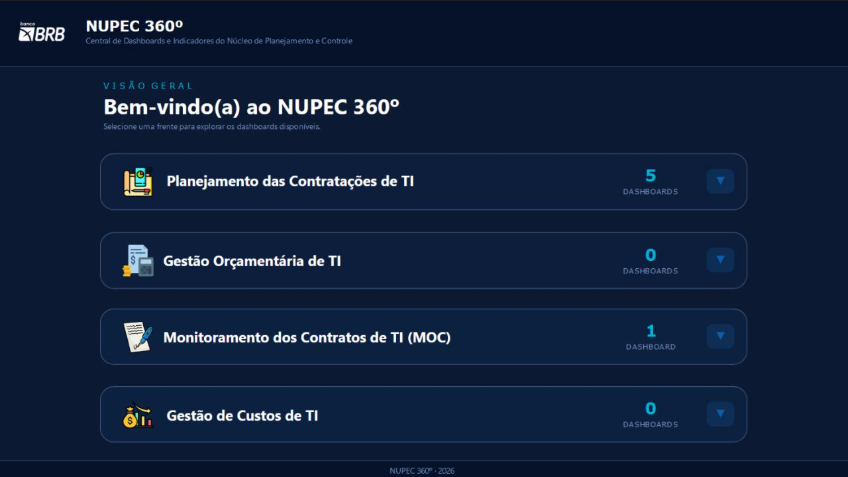

# NUPEC 360º — Central de Dashboards e Indicadores (BRB)

  Banco de Brasília (BRB)
  Business Intelligence
  Governança de TI
  Power BI Service

!!! warning "Nota de Confidencialidade e Sigilo Corporativo"
    Por razões de **sigilo bancário**, diretrizes de segurança da informação e estrita conformidade com a **LGPD (Lei Geral de Proteção de Dados)** no âmbito do **Banco de Brasília (BRB)**, informações operacionais e estratégicas sensíveis — incluindo **nomes de contratos**, **valores financeiros e orçamentários**, **dados de empresas contratadas** e **nomes de colaboradores e gestores** — são estritamente confidenciais e foram preservadas/omitidas.
    
    Esta documentação apresenta exclusivamente uma visão arquitetural de alto nível, os pilares funcionais da plataforma e a metodologia de governança aplicada na concepção do ecossistema analítico.

---

## Visão Geral

Desenvolvimento do ecossistema analítico **NUPEC 360°**, um aplicativo centralizador de **Business Intelligence** estruturado para o **Núcleo de Planejamento e Controle (NUPEC)** da Diretoria de Tecnologia do BRB. 

O projeto unifica múltiplas frentes de gestão de Tecnologia da Informação em uma única plataforma integrada no **Power BI Service**, transformando dados complexos de contratações de TI em uma visão executiva transparente, confiável e acionável para tomada de decisão.

---

## Contexto e Desafios

O Núcleo de Planejamento e Controle atua como elemento central na orquestração de governança, fiscalização e acompanhamento das contratações de soluções de tecnologia do banco. Antes da consolidação da plataforma:

* **Dispersão de Informações:** Dados de acompanhamento de demandas, pareceres técnicos, status de processos e contratos estavam fragmentados entre planilhas, sistemas departamentais e despachos internos.
* **Complexidade no Acompanhamento de Prazos:** A esteira de contratação de TI envolve múltiplos marcos regulatórios, exigindo controle minucioso para evitar descontinuidade de serviços essenciais.
* **Necessidade de Visão Executiva Unificada:** A liderança de TI demandava um canal centralizador onde pudesse alternar com agilidade entre a visão macro estratégica e a análise detalhada de cada processo.

---

## Hub Centralizador do Ecossistema

O **NUPEC 360º** foi projetado com uma interface corporativa em *dark theme*, hierarquizando os acessos em categorias funcionais e indicando em tempo real a quantidade de painéis ativos em cada frente de atuação:

  

Hub de entrada do NUPEC 360º: arquitetura modular e navegação estruturada por frentes corporativas de TI.

---

## Frentes de Gestão Integradas

O ecossistema foi desenhado de forma escalável, abrangendo quatro frentes fundamentais da governança de TI:

### 1. Planejamento das Contratações de TI (5 Dashboards)
Frente responsável pelo rastreamento integral do ciclo de vida das aquisições e contratações de TI, monitorando desde a concepção do Estudo Técnico Preliminar (ETP) e Termo de Referência (TR) até a efetiva publicação e contratação:

* Acompanhamento do alinhamento às metas do Plano de Contratações de TI (PCTI).
* Controle de tempos médios de tramitação por setor responsável.
* Identificação proativa de gargalos operacionais e prazos críticos.

### 2. Monitoramento dos Contratos de TI — MOC (1 Dashboard)
Painel especializado no suporte à gestão e fiscalização de contratos vigentes:

* Visão consolidada da vigência de contratos e cronogramas de renovação, aditamento ou encerramento.
* Centralização dos responsáveis técnicos e fiscais designados para cada instrumento contratual.
* Apoio na mitigação de riscos contratuais e asseguração de continuidade operacional.

### 3. Gestão Orçamentária de TI
Frente estruturada para acompanhamento da execução orçamentária da área tecnológica:

* Rastreamento de dotações orçamentárias, reservas e empenhos de tecnologia.
* Comparativo entre orçamento planejado e executado por período.

### 4. Gestão de Custos de TI
Módulo desenhado para análise de alocação de recursos e centros de custo:

* Visibilidade de rateios e direcionamento de investimentos tecnológicos no conglomerado.
* Apoio em análises de eficiência e otimização de gastos em TIC.

---

## Stack Tecnológica & Arquitetura

* **Ambiente Analítico:** **Power BI Service** — implantação via *Power BI App*, assegurando distribuição unificada, navegação fluida e isolamento de relatórios em ambiente corporativo seguro.
* **Lógica e Cálculos de Negócio:** **DAX Avançado** — fórmulas para cálculo dinâmico de indicadores de prazos, cumprimento de etapas, volumetria de demandas e métricas dimensionais.
* **Engenharia e Tratamento:** **Power Query (Linguagem M)** — pipelines de padronização, limpeza e cruzamento de bases heterogêneas com governança de dados.
* **Governança & Segurança:** Gestão de permissões corporativas integradas ao ecossistema Microsoft 365 do banco, garantindo acesso restrito conforme o perfil e nível de alçada do usuário.
* **UI/UX Executivo:** Design padronizado às diretrizes visuais do BRB, utilizando estética escura focada em contraste analítico e rápida identificação visual das frentes de gestão.

---

## Impacto e Valor Entregue

* **Fonte Única da Verdade:** Unificação das bases de planejamento e contratos de TI, extinguindo a divergência de relatórios descentralizados.
* **Tomada de Decisão Ágil:** Visões analíticas sintetizadas que permitem à diretoria e aos gestores do NUPEC identificar prioridades e gargalos em instantes.
* **Governança Preventiva:** Monitoramento preditivo de vencimentos de prazos e contratos, resguardando a continuidade dos serviços de tecnologia do banco.
* **Segurança e Conformidade:** Garantia irrestrita de sigilo bancário e proteção de dados sensíveis corporativos através de perfis seguros de publicação.

---

<a href="../../" class="back-link">&larr; Voltar para o Início</a>
