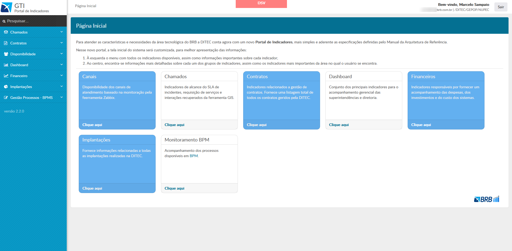
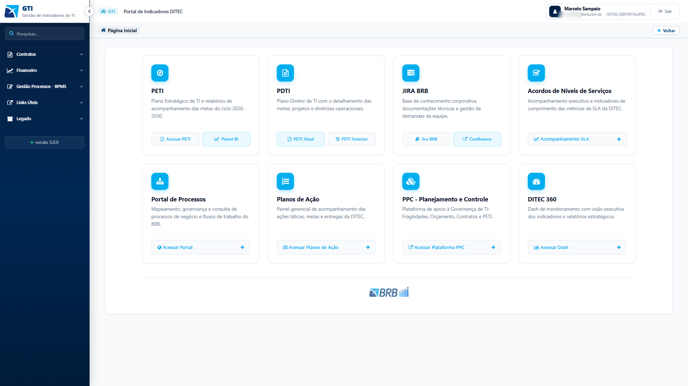
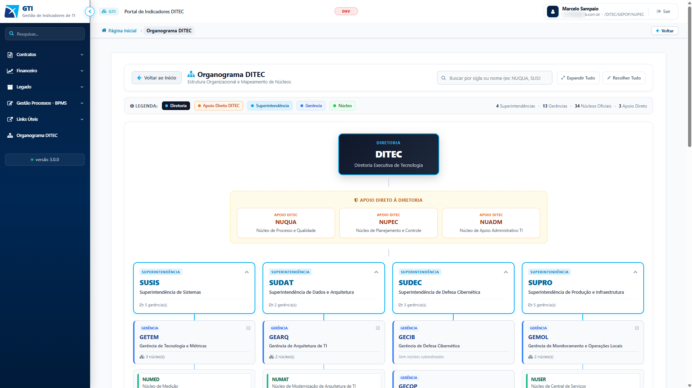
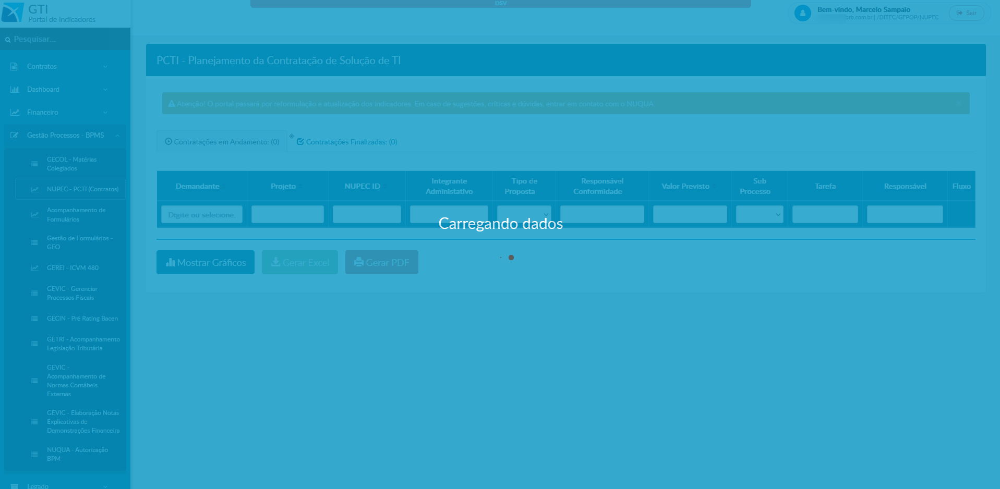

# Modernização do Portal GTI — DITEC (BRB)

  Banco de Brasília (BRB)
  Desenvolvimento Web
  AngularJS
  Governança de TI
  REST APIs

  

O **Portal GTI (Gestão de Indicadores de TI)** é o sistema corporativo central da Diretoria Executiva de Tecnologia (DITEC) do **Banco de Brasília (BRB)**. A plataforma centraliza governança estratégica, acompanhamento de metas do PETI e PDTI, monitoramento de contratos, acordos de níveis de serviço (SLAs) e indicadores operacionais de tecnologia.

Neste projeto, executei a **refatoração integral da interface** (migração da versão 2.2.0 para a 3.0.0), reestruturando a experiência de uso (UI/UX) com **HTML5**, **CSS3**, **AngularJS** e **Gulp**. A nova versão incluiu módulos de exportação sob demanda em **PDF e Excel**, integração com **APIs REST internas** de múltiplos setores do banco, navegação por **breadcrumbs** com retenção de contexto e uma visão interativa do **Organograma da DITEC**.

---

## Contexto e Desafios

* **Interface defasada e ergonomia:** A versão anterior (v2.2.0) apresentava baixa hierarquia visual, elementos rígidos e falta de padronização nas ações dos usuários, dificultando a localização rápida de métricas.
* **Necessidade de exportação direta de relatórios:** Módulos estratégicos, como o Plano de Contratações de TI (PCTI), não possuíam recursos nativos de extração de dados, exigindo compilação manual para reuniões e auditorias.
* **Centralização de dados corporativos:** Áreas como GEVIC, GECIN, GETRI, NUPEC e GECOL mantinham rotinas analíticas dispersas. O sistema precisava atuar como agregador consumindo diretamente endpoints de serviços internos.
* **Visualização da estrutura hierárquica:** Era necessária uma representação dinâmica e navegável de todas as superintendências, gerências e núcleos oficiais da diretoria.

---

## Stack Tecnológica

* **Frontend:** HTML5 semântico, CSS3 (Flexbox/Grid, variáveis de cores institucionais) e JavaScript (ES6+).
* **Framework SPA:** **AngularJS (1.x)** — arquitetura modular com controllers, services para requisições assíncronas a endpoints REST, diretivas customizadas e gerenciamento de rotas.
* **Automação de Build:** **Gulp** — pipeline para compilação de assets, minificação de scripts e estilos e preparação dos pacotes para ambientes de homologação (DSV) e produção (PRD).
* **Integração de Dados:** Consumo de APIs REST corporativas para alimentação em tempo real de processos e painéis de indicadores.
* **Exportação de Arquivos:** Geração no cliente de relatórios formatados em **PDF** e planilhas **Excel (.xlsx)** com base nas visualizações filtradas.

---

## Comparativo de Interface: Versão 2.2.0 vs. 3.0.0

A reformulação substituiu a estrutura anterior por uma arquitetura em cards, com melhor legibilidade de dados e atalhos objetivos para as principais ferramentas.

  
  

    
    
Versão 2.2.0 (Legada) — Navegação estática e baixa densidade informacional

  

  

    
    
Versão 3.0.0 (Refatorada) — Cards estruturados, atalhos diretos e identidade corporativa

  

---

## Módulos Desenvolvidos

### Organograma Interativo da DITEC

Mapeamento visual e navegável de toda a cadeia organizacional da Diretoria Executiva de Tecnologia:

* **Cobertura completa:** Representação das 4 Superintendências (SUSIS, SUDAT, SUDEC, SUPRO), 13 Gerências, 34 Núcleos Oficiais e 3 Unidades de Apoio Direto (NUQUA, NUPEC e NUADM).
* **Funcionalidades:** Busca em tempo real por sigla ou nome da unidade, controles globais de expansão/recolhimento e código de cores por nível hierárquico.

  

Visão estrutural da DITEC com controles de busca e navegação hierárquica.

---

### Navegação Estruturada com Breadcrumbs

Implementação de trilha de navegação com retenção de contexto para relatórios multinível:

* **Rastreabilidade:** Caminho percorrido acessível em tempo real (*ex: Página Inicial > Listagem SAP > Gráficos > PEC > PCTI*).
* **Retorno ágil:** Botão contextual "Voltar" preservando filtros aplicados nas telas anteriores.

  

Trilha navegável de localização com suporte a histórico e retorno direto.

---

### Exportação de Relatórios e Integração com APIs

Automatização do fluxo de trabalho no módulo de processos (PCTI):

* **Exportação sob demanda:** Criação dos fluxos de download para planilhas Excel (.xlsx) e relatórios formatados em PDF respeitando os filtros ativos da tabela.
* **Alternância de visualização:** Visualização gráfica imediata dos dados tabulares com um clique.
* **Consumo de serviços internos:** Integração com APIs REST corporativas para setores de governança e controle (GECOL, NUPEC, GEREI, GEVIC, GECIN, GETRI e NUQUA).

  

Módulo PCTI com exportação de relatórios e painéis alimentados por APIs REST.

---

### Menu Lateral Colapsável

Reestruturação da sidebar com foco em usabilidade e ganho de área útil em resoluções menores:

* **Modo compacto (ícones):** Ocultação de rótulos de texto com apenas um clique para expandir a área de tabelas analíticas.
* **Navegação em acordeão:** Submenus categorizados por domínio (Contratos, Financeiro, BPMS, Legado).

  

    
    
Modo Compacto — Otimização de espaço para análise de dados

  

  

    
    
Modo Expandido — Organização de subsistemas por categorias

  

---

## Comparativo Técnico

| Aspecto | Versão Anterior (v2.2.0) | Versão Refatorada (v3.0.0) |
| :--- | :--- | :--- |
| **Interface** | Layout estático em blocos sem padronização | Design system limpo, responsivo e com hierarquia clara |
| **Navegação** | Sem histórico de localização | Breadcrumbs interativos com preservação de estado |
| **Exportação** | Restrita à cópia manual de tela | Geração direta de arquivos PDF e Excel (.xlsx) |
| **Integração** | Dados isolados | Consumo automatizado de APIs REST corporativas |
| **Menu Lateral** | Fixo e sem agrupamentos | Colapsável com suporte a submenus em dropdown |
| **Organograma** | Inexistente no sistema | Mapeamento interativo com busca dinâmica por sigla |
| **Build & Deploy** | Tarefas manuais | Pipeline automatizado via Gulp para DSV e PRD |

---

## Resultados e Impacto Operacional

1. **Acesso unificado:** Centralização de indicadores antes espalhados por diferentes planilhas e e-mails em uma única interface corporativa.
2. **Eliminação de trabalho manual:** Redução no tempo de preparação de dossiês contratuais e relatórios operacionais com exportação direta.
3. **Ergonomia e padronização:** Experiência consistente para gestores e equipes técnicas da DITEC com identidade visual alinhada às normas do banco.

---

<a href="../../" class="back-link">&larr; Voltar para o Início</a>
