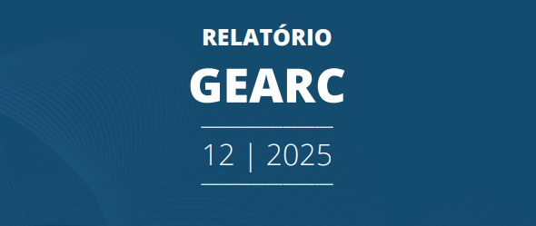

# Relatório Gerencial Auto

Este projeto representa uma solução completa de **automação de ponta a ponta**, que transforma consultas complexas em SQL Server em documentos oficiais prontos para assinatura (.docx e .pdf). A solução utiliza **Docker** para garantir um ambiente isolado e padronizado, eliminando erros de configuração e reduzindo o tempo de produção de dias para minutos.

---

## 🔍 Onde Encontrar
Os relatórios automáticos podem ser encontrados no [portal da transparência no site da Funpresp-Jud](https://www.funprespjud.com.br/relatorios/), nas abas da **GEARC** (Gerência de Arrecadação e Cadastro). 
* **Marco do Projeto:** Relatórios publicados a partir de julho de 2025 já utilizam esta tecnologia.

## 🎯 O Desafio
Mensalmente, a elaboração do Relatório Gerencial de Arrecadação exigia a coleta manual de dados de mais de 10 indicadores financeiros e cadastrais. O processo envolvia a formatação repetitiva de tabelas e a criação manual de gráficos, o que gerava um gargalo operacional e riscos à integridade dos dados.

## 🛠️ Stack Tecnológica
* **Linguagem:** Python.
* **Conteinerização:** Docker (Isolamento de dependências e drivers SQL).
* **Manipulação de Dados:** Pandas.
* **Integração com Banco de Dados:** SQLAlchemy (SQL Server).
* **Geração de Documentos:** Python-Docx e exportação para PDF.
* **Visualização Automática:** Matplotlib e Plotly.
* **Versionamento:** Bitbucket.

## ⚙️ Arquitetura da Solução
Diferente de um dashboard estático, esta automação funciona como um pipeline inteligente e portátil:

1.  **Ambiente Dockerizado:** Toda a aplicação foi empacotada em um container Docker, garantindo que os drivers do SQL Server e as bibliotecas de geração de PDF funcionem de forma consistente, independente do servidor de execução.
2.  **Orquestração SQL:** O script executa múltiplas queries complexas diretamente no SQL Server para consolidar o histórico de arrecadação e cadastro.
3.  **Lógica Condicional Avançada:** Implementei um motor de regras em Python que analisa as variações financeiras e **gera textos dinâmicos** (Ex: redação automática de justificativas para oscilações acima de X%).
4.  **Gráficos On-the-fly:** Geração automática de visualizações que são inseridas diretamente no corpo do documento Word.

---

## 🏆 Impacto no Negócio e Resultados
A implementação desta automação liberou a agenda estratégica da gestão e resolveu gargalos históricos de entrega.

| Métrica | Processo Manual (Antigo) | Solução Automatizada (Atual) |
| :--- | :--- | :--- |
| **Responsável** | Gerente de Área | Pipeline Python (Autônomo) |
| **Tempo de Execução** | Dias de trabalho manual | < 5 minutos |
| **Atraso na Entrega** | Meses (Gargalo operacional) | Zero (Entrega imediata) |
| **Tecnologia** | Tableau, Excel e Word manual | Python + Docker + SQL |

---

## 🖼️ Transformação Visual: Antes vs. Depois

A automação não apenas otimizou o tempo, mas elevou drasticamente o padrão de apresentação e clareza dos dados.

  
  

    <h3 style="color: #d32f2f;">❌ Processo Manual (Antes)</h3>
    
Consolidação lenta em planilhas, formatação manual de tabelas e redação de textos repetitivos suscetíveis a erros.

    
  

  

    <h3 style="color: #388e3c;">✅ Solução Automatizada (Depois)</h3>
    
Documento oficial (.docx/.pdf) gerado em minutos via Python, com gráficos dinâmicos, textos redigidos automaticamente e layout padronizado.

    
  

#### (Clique nas imagens para ver os relatórios publicados)

---

[⬅️ Voltar para o Início](../index.md)