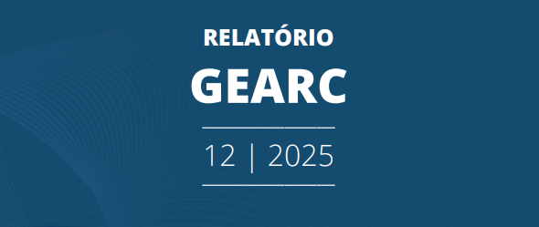
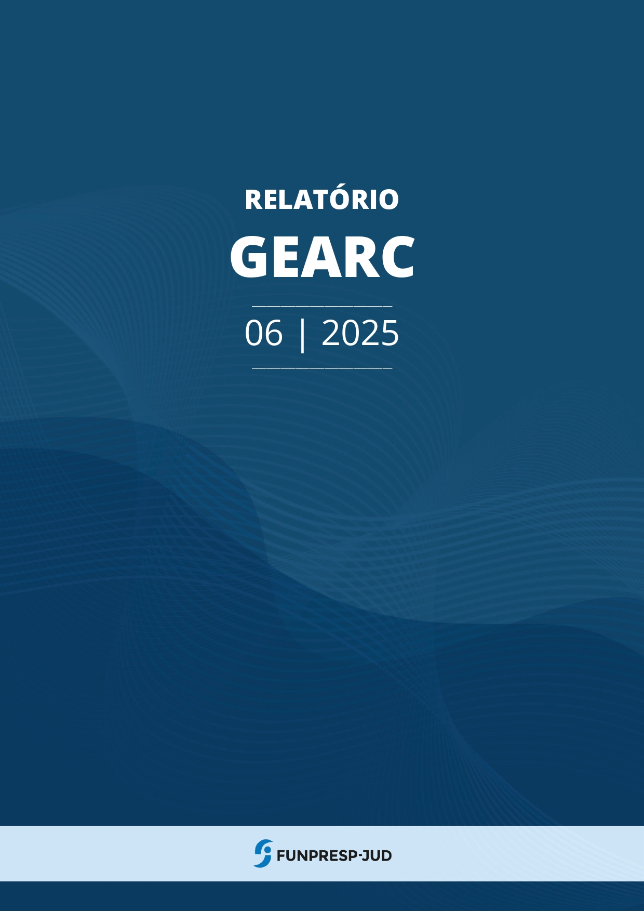

# Relatório Gerencial Automático

  Funpresp-Jud
  Automação & Engenharia
  Python
  Docker
  SQL Server

  

Automação desenvolvida para a Gerência de Arrecadação e Cadastro (GEARC) da **Funpresp-Jud**, responsável por extrair dados do SQL Server, processar indicadores cadastrais e financeiros e gerar relatórios executivos em formatos `.docx` e `.pdf` prontos para assinatura e publicação. A aplicação é executada em container **Docker**, assegurando padronização de ambiente, isolamento de dependências e agilidade na entrega.

---

## Publicação Oficial

Os relatórios periódicos da fundação estão disponíveis para consulta pública no [portal da transparência da Funpresp-Jud](https://www.funprespjud.com.br/relatorios/), na seção da **GEARC**. As publicações emitidas a partir de julho de 2025 utilizam a tecnologia deste pipeline automatizado.

---

## Contexto e Desafio

Mensalmente, a elaboração do Relatório Gerencial de Arrecadação exigia a coleta manual de mais de 10 indicadores financeiros e operacionais. O fluxo envolvia consolidação em planilhas eletrônicas, formatação individual de tabelas e geração manual de gráficos. Esse processo representava um gargalo na rotina da gerência, além de aumentar o risco de inconsistências nos dados publicados.

---

## Stack Tecnológica

* **Linguagem Principal:** Python.
* **Conteinerização:** Docker (drivers ODBC e bibliotecas em ambiente isolado).
* **Engenharia de Dados:** Pandas e SQLAlchemy (conexão com SQL Server).
* **Geração de Documentos:** Python-Docx e pipeline de exportação para PDF.
* **Visualização de Dados:** Matplotlib.
* **Controle de Versão:** Git / Bitbucket.

---

## Arquitetura da Solução

O sistema opera como um pipeline analítico autônomo estruturado em quatro etapas:

1. **Ambiente Isolado (Docker):** A aplicação executa em um container com todas as dependências do sistema operacional, garantindo que drivers do banco e utilitários de conversão funcionem de forma idêntica em qualquer servidor.
2. **Extração e Consolidação:** Consultas estruturadas são disparadas no SQL Server para agregar o histórico de arrecadação, número de participantes e movimentações cadastrais.
3. **Motor de Regras Textuais:** Algoritmos em Python calculam variações percentuais e redigem automaticamente as seções explicativas do relatório (por exemplo, análises comparativas de crescimento de receita ou oscilação de repasses).
4. **Composição Visual e Exportação:** Tabelas e gráficos são gerados e injetados diretamente no modelo de documento oficial, com posterior conversão para PDF assinado digitalmente.

---

## Métricas de Impacto

| Métrica | Processo Manual (Anterior) | Solução Automatizada (Atual) |
| :--- | :--- | :--- |
| **Responsável pela Execução** | Gerente e analistas da área | Pipeline autônomo em Python |
| **Tempo de Produção** | Dias úteis de esforço manual | Menos de 5 minutos |
| **Previsibilidade de Entrega** | Sujeito a fila operacional | Emissão imediata ao fechamento do mês |
| **Ferramentas Utilizadas** | Tableau, Excel e Word manual | Python, Docker e SQL Server |

---

## Comparativo: Antes e Depois

A automação padronizou o formato visual das publicações, assegurando rigor técnico e uniformidade institucional.

  
  

    

      Processo Manual
      <h3 class="report-card-title">Processo Manual (Antes)</h3>
      
Consolidação manual em planilhas, tabelas diagramadas artesanalmente e redação repetitiva de dados suscetível a falhas operacionais.

    

    
    

      
    

    

      <a href="https://www.funprespjud.com.br/wp-content/uploads/2025/07/gearc_06_2025.pdf" 
         target="_blank" 
         rel="noopener noreferrer" 
         class="report-btn report-btn--secondary">
        Acessar Relatório Manual (PDF 06/2025) &nearr;
      </a>
    

  

  

    

      Solução Automatizada
      <h3 class="report-card-title">Solução Automatizada (Depois)</h3>
      
Documento oficial (.docx/.pdf) emitido em minutos via pipeline Python, com gráficos dinâmicos, textos redigidos por regras e diagramação corporativa.

    

    
    

      
    

    

      <a href="https://www.funprespjud.com.br/wp-content/uploads/2026/07/gearc_06_2026.pdf" 
         target="_blank" 
         rel="noopener noreferrer" 
         class="report-btn report-btn--primary">
        Acessar Relatório Automatizado (PDF 06/2026) &nearr;
      </a>
    

  

Clique nas capas para ampliar em alta resolução ou utilize os botões acima para visualizar os relatórios oficiais completos em PDF.

---

<a href="../../" class="back-link">&larr; Voltar para o Início</a>